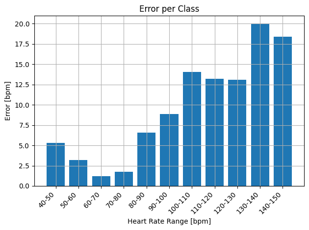
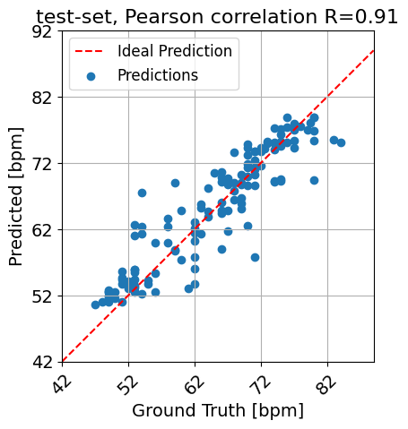
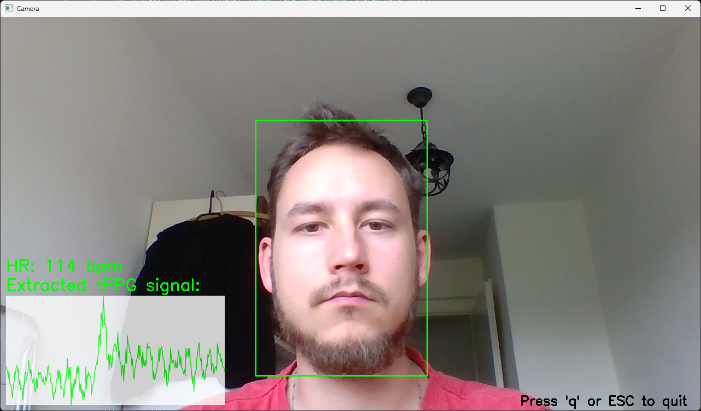

# Hearth Rate estimation using Convolution Neural network
This is repositiry for master work focusing on implpementation of the visual hearth rate estimator. This repository contains the implementation of [HR-CNN method](https://cmp.felk.cvut.cz/~spetlrad/ecg-fitness/visual-heart-rate.pdf).
It also contains tools for training and evaluating models for heart rate estimation on normalized datasets. This project contains dataset_creator.py module which is capable of creating the normalized dataset from two publiclt available datasets. The [ECG-fitness dataset](https://cmp.felk.cvut.cz/~spetlrad/ecg-fitness/) and [PURE dataset](https://www.tu-ilmenau.de/universitaet/fakultaeten/fakultaet-informatik-und-automatisierung/profil/institute-und-fachgebiete/institut-fuer-technische-informatik-und-ingenieurinformatik/fachgebiet-neuroinformatik-und-kognitive-robotik/data-sets-code/pulse-rate-detection-dataset-pure).

# Usage

First the requirements in requirements.txt has to be satisfied.
The config_files directory contains examples of the .yaml config files that has to be passed to the scripts. Each config file contains explenatory comments. 

There are 4 scripts:
* config_extractor.yaml

* config_estimator.yaml

* config_eval.yaml

* config_demo.yaml

## Training 
If you want to train on your data please see the [Dataset handling](#dataset-handling) section below.
### Training the extractor
First the config file has to be filled. Please see the **config_files/config_extractor.yaml**. It contains the following items that has to be set.
* __data__ contains path to the folder with the normalized dataset (**dataset_dir**) and path where the results of the training are supoased to be saved (**output_dir**).The **benchmark** is a path to the **banchmark.yaml** file, see the example benchmark file **benchmarks/benchmark_example.yaml**. The benchmark contains which folder specified in **data.csv**(for more information about data.csv and normalized datasets in this project see section [Dataset handling](#dataset-handling) below) in the datasets folder are used for training, validation and testing. For example if the **data.csv** file looks like this:
```
vid1,vid2
vid3,vid4
vid5,vid6
```
and the benchmark.yaml looks like this:
```
trn: [0,1]
val: [2]
tst: [2]
all: [0,1,2]
```
The training set will contain the videos in folder specified by the line, in this example: 0 and 1 in **data.csv** so the vid1, vid2, vid3 and vid4 will be used for training and the validation and testing subset woul contain only vid5 and vid6.

* __extractor_model_path__ specifies the .py file with the pytorch model used as extractor. The name of the class in the .py file has to be named "Extractor". There are 2 models the implemented extractor as described in [HR-CNN method](https://cmp.felk.cvut.cz/~spetlrad/ecg-fitness/visual-heart-rate.pdf) with path Models/extractor_model.py and the improved extractor model proposed in my thesis with the path **Models/extractor_improved.py**.

* __optimizer__ contains paraeters for the training.
* __hr_data__ contains the range of the hearth rate, tolerance and samplinf frequency of the loss function as defined in the SNR loss function of the extractor.
* __train__ and __valid__ specifies the dataset loader class. The sequence length and the shifting of the windows can be sat there as well as the augmentation. It can be only turned on and off in this config file for more detailed setting of the augmentation the source code have to be modified in the beggining of the file **Dataset_handlers/Extractor/dataset_loader.py**
* __load_model__ Can be either True or False. If True the extractor trained rries to load the weights specified in __load_model_path__ before training.

When the config file is properly filled and is saved on the path: "path/to/config.yaml". The training of the extractor can be started by calling **train_extractor.py** with "path/to/config.yaml" as argument: 
```
python3 train_extractor.py path/to/config.yaml
```
The expected output is:
```
Device to train on:
```
If there are more cuda capable devices type just the number and press enter, for example for training on the cude device with id 2:
```
Device to train on:2
```
and press enter. You can also write "cpu":
```
Device to train on:cpu
```
to run the training on the cpu. (But why?)
The expected output after choosing the device is following:
```
Training started
Model: Models/extractor_model5.py
Output path: output/pure_demo
optimizer stats: {'batch_size': 1, 'cumulative_batch_size': 30, 'lr': '1e-4', 'max_epochs': 600, 'patience': 50, 'decrease_lr': True, 'lr_decay': 0.1, 'lr_decay_epochs': [20, 50, 100, 150]}
train stats: {'sequence_length': 150, 'shift': 50, 'augment': True}
valid stats: {'sequence_length': 150, 'shift': 150, 'augment': False}
EMA loss:7.7784 ,epoch progress: 104 % ,eta: 194.0 h and 27.0 m
validation
loss:6.0680 ,progress: 99 %
epoch 0 done, validation loss: 6.067966938018799 ,train loss: 7.7418570763280155
EMA loss:8.0738 ,epoch progress: 104 % ,eta: 194.0 h and 7.0 m
validation
loss:3.9572 ,progress: 99 %
epoch 1 done,
```

### Training the estimator
The same procedure has to be done for the estimator training. The configuration file (example cnfig file: **config_files/config_estimator.yaml**) has to be filled and it contains a lot of the same settings as the extractor but there are differences:
* __data__ contains path to the normalized dataset and: **extractor_dataset_dir** and path to the weights of the trained extractor: **extractor_weights**. the estimator trained uses these two to generate a new dataset different from the normalized one on the path specified by **estimator_dataset_dir**. The new created has very similar structure with the one sescribed in [Dataset handling](#dataset-handling) but it doesnt contains the images but the rPPG signal extracted by the extractor model.
* __extractor_model_path__ is again the path to the .py file with the pytorch implementation of the extractor model. And __estimator_model_path__ is added to specify the path to the .py file with the pytorch implementation of the estimator model. There is available estimator model implementation with path **Models/estimator_model.py**
* __optimizer__ is almost the same as in the extractor config file
* __create_new_dataset__ can be set to Tree and False. If True the estimator dataset will be created even if on the path specified by the __estimator_dataset_dir__ already exists and contains a dataset. If it is set to False it check id there already exists a dataset in the specified path (__estimator_dataset_dir__) and if there is, the estimator trained will use that one instead of creating the new one. ⚠️ **Warning:** When the estimator dataset is not complete be cautious the trainer doesnt know that and will try to use the incomlete dataset.
* __dataset_creator_N__ specifies the batchsize with which the dataset for the estimator is being created. This value can be large on when a lot of vram is available but it has to be smaller when the vram is limiting the process.
* __dataset_creator_augmentation__ Can set wheather the augmentation of the frames is set or not when generating the estimator dataset.
* __train__ and __valid__ are the same as in extractor
* __load_model__ and __load_model_path__ are also the same

When the config file is set and saved in "path/to/config.yaml" the training can be executed by calling **train_estimator.py** with the path to the cofig file as arument:
```
python3 train_estimator.py path/to/config.yaml
```
The expected output is again:
```
Device to train on:
```
And the id of the device or "cpu" can be written and accepted by pressing enter. The expected output after choosing the device is following:
```
Estimator dataset already exists
Epoch: 0, Loss: 94.43851375579834
Validation Loss: 78.15306489666303
Epoch: 1, Loss: 68.1243224143982
Validation Loss: 37.71448912719885
```

## Evaluation
The trained models can be evaluated and the configuration file for evaluating has to be set first.
The example id the configuration file for evaluation: **config_files/config_eval.yaml**. It contains the following:
* __data__ this contains the path to the benchmark, dataset (in this case the normalized dataset for the extractor is meant) and path to the folder where the result will be saved.
* __models__ sets the paths for both models (extractor and estimator) in python files.
* __weights__ sets the paths for the trained models weights saved in .pth files.
* __save_predictions_to_txt__ can be Trie or False. If True all the predictions will be saved in the output folder along with the ground truth heart rates for further processing.
* __dataset_options__ again just sets the options for the dataset loader.
The evaluaiton can be executed by calling the **evaluate.py** with the path to the config file path/to/config.py as an argument:
```
python3 evaluate.py path/to/config.yaml
```
There are two graphs as output of the evaluation and the result are saved in result.csv in the output folder. The exaples of the outputed graphs:

 

## Demos
There are two demos: Real-itme demo and offline demo. Both uses the same format of configuration file. The example of the config file is in **config_files/config_demo.yaml**, it contains:
* __models__ this sets the path to the .py files with the implementation of the extractor and the estimator in pytorch.
* __weights__ sets paths for the weights of the trained models.
### Real-time demo
The realtime demo can be executed by calling **demos/real_time_demo.py** with the path to the config file in path/to/config.yaml as an argument.
```
python3 demos/real_time_demo.py path/to/config.yaml
```
The expected behavior is opencv window with the bounding box around the detected face and after 10 seconds with the estimation of the heart rate and the extracted rppg signal(last 10 seceonds of the signal):
 
There are also prepared weights for the extractor and estimator which can be used. There is also prepared config file for this demo. To start the real-time demo use this command:
```
python3 demos/real_time_demo.py config_files/config_real_time_demo.yaml     
```
The real-time demo udates the predictid value and the extracted rPPG signal every 10 seconds. It tries to execute the inference on the cuda device if available. When tring to uexecute on cpu it doesnt keep up.

### Offline demo
⚠️ **Warning:** tested only on windows OS.
The offline demo can be executed by calling the **demos/offline_demo.py** with the set of arguments.
* __path/to/config.yaml__ the frst argument is the path to the configuration .yaml file
* __path/to/video__ path to the video wchich we eant to precess
* __path/to/output_dir__ path to the directory where we want the results to be saved.
the offline demo is then exxecuted the following way:
```
python3 demos/offline_demo.py path/to/config.yaml path/to/video path/to/output_dir
```


# Dataset handling
The abovementioned dataset PURE and ECG-fitness can be used and the module dataset_creator.py can be used to create the normalized datasets for this project. If you want to use different dataset you need to prepare the normalized form of it. The normalized form has a given structure:
```
dataset-folder/
├── video-0-folder/
│   ├── 0.png
│   ├── 1.png
│   ├── 2.png
│   ⋮
│   ├── N-1.png
│   ├── fps.txt
│   └── hr_data.txt
├── video_1_folder/
│   ├── 0.png
│   ⋮
│   ├── N-1.png
│   ├── fps.txt
│   └── hr_data.txt
├── video_last_folder/
│   ├── 0.png
│   ⋮
│   ├── N-1.png
│   ├── fps.txt
│   └── hr_data.txt
└── data.csv
```
The dataset folder contains folders of videos, the names of the video folders can be chosen. Inside every video folder are png files corresponding to frames of the video. Starting with frame 0 and ending with frame N-1. The naming of the png images has to be **0.png**,**1.png**,...,**N-1.png** where N is the number of frames in the video. The png images arent the actual frames from the video. They are cropped images of face extrated from each frame of the video. If you are creating you own data the **face_extractor.py** module can be used for the task of extracting the face from each frame. The fps.txt containg float number of the capturing frequency of each video. The **hr_data.txt** contains the ground truth frequency in peats per minute (BPM). Each line in **hr_data.txt** coresponds to the frame number. The frequency for the frame 0 is on the first line of the **hr_data.txt**. Finally the **data.csv** contains folder which you want to use. The names of the video folder are used in the **data.csv**. For example if there would be 4 video folders: vid1, vid2, vid3, vid4. And you want 2 folders, each containing 2 videos the **data.csv** would look like this:
```
vid1,vid2
vid3,vid4
```
With 1 folder containing vid1 and vid2 and second folder containing vid3 and vid4. Practically if your data has for example more subjects(people) you can group them in folder using the **data.csv**.


### Synthetic data dataset
 The synthetic data can be created using /synthetic_data/create_synhtetic_dataset.py
It can be called with arguments see help (python create_synthetic_data.py -h)

### Real data dataset
A dataset from real data can be created using dataset_creator.py
Currently it supports only creating dataset from ECG-fitness dataset.
It can be called with argument, see help.

### Training 
The training is implemented in train.py. See help. The weights are  being saved each epoch of training in folder model_weights. The training uses tensorboard to log the progress of the training.

### Evaluation
If the model is trained it can be evaluated using evaluate.py. See help. It calculates the average deviation of the predicted hearth-rate and the real one. It also caluclate root mean square average and the signal to noise ration(since it is the loss function).
